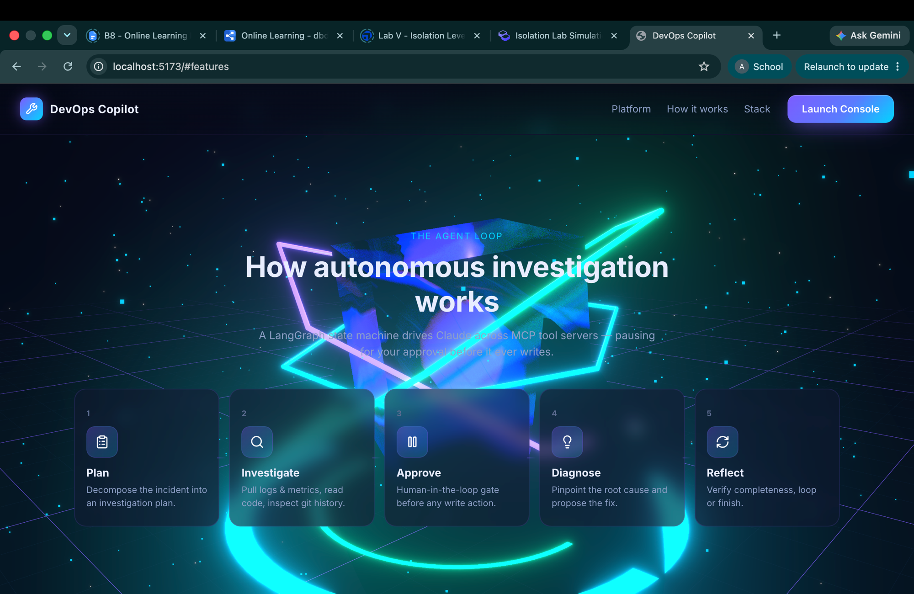

<div align="center">

# 🛠️ DevOps Copilot — AI Incident Command Center

**An autonomous AI agent that investigates production incidents end-to-end — pulling logs & metrics, reading code, finding the root cause, and proposing a fix — pausing for human approval before it ever writes.**


</div>

<p align="center">
  
</p>

---

## Overview

**DevOps Copilot** turns a one-line question — *"Why is the checkout API throwing 500s?"* — into a complete, evidence-backed root-cause analysis. A **LangGraph** state machine drives an LLM across a set of **MCP (Model Context Protocol)** tool servers: it plans, gathers logs/metrics, reads the code and git history, diagnoses the bug, and drafts a pull request — **stopping for your approval before any write action**.

It's a full-stack reference implementation of a modern agentic system:

- **Backend** — Python · LangGraph · MCP · FastAPI, provider-switchable between **Claude Opus 4.8** and **Groq/Llama**.
- **Frontend** — a React + TypeScript console with a real **WebGL 3D command center** (React Three Fiber), a live agent-activity timeline, and a human-in-the-loop approval UI.

---

## ✨ Highlights

| | |
|---|---|
| 🧠 **Real agentic control flow** | A LangGraph graph with cycles, a reflection loop, a bounded iteration guard, and a resumable **`interrupt()`** for human approval. |
| 🔌 **Three MCP servers (one fully custom)** | `logs-metrics`, `repo`, and `github` — discovered at runtime via `langchain-mcp-adapters`. Adding a fourth is one dict entry. |
| ✋ **Human-in-the-loop** | Every write (e.g. opening a PR) pauses the graph; the reviewer sees the exact action and approves/rejects. State is checkpointed, so the pause survives across requests. |
| 🔁 **Provider-switchable** | Claude Opus 4.8 or Groq/Llama — change it (and paste a key) **from the UI**, no restart. |
| ⚙️ **Runtime configuration** | Connect a real **GitHub repo**, point the **repo / logs** servers at your own data, and switch models — all validated server-side, live. |
| 🎨 **5 themes + 3D backdrop** | Cosmic, Midnight, Forest, Sunset, Light — the whole UI (and the 3D glow) recolors instantly. |
| 🧪 **Production touches** | SQLite checkpointing, an eval harness, graceful error handling, Docker, and config via environment. |

---

## 🏗️ Architecture

```
        ┌─────────────┐   ┌──────────────────────┐
        │   CLI       │   │  React console + 3D  │      Interfaces
        └──────┬──────┘   └───────────┬──────────┘
               └──────────────┬───────┘  (FastAPI: /chat, /approve, /config, …)
                              ▼
        ┌────────────────────────────────────────────┐
        │            LangGraph state machine          │
        │                                             │
        │   plan ▶ agent ▶ (route)                    │
        │            │  ├─ write?  ▶ approval ────────┤ ◀── human ✅ / ❌
        │            │  ├─ read?   ▶ tools ───────────┤
        │            │  └─ done?   ▶ reflect ─────────┤
        │            └─────────────◀──────────────────┘
        │   checkpointer: SQLite (resumable, per-thread)
        └────────────────────────┬───────────────────┘
                                 ▼   (MCP protocol, stdio)
   ┌──────────────────┬───────────────────┬──────────────────────┐
   │   logs-metrics   │       repo        │        github        │  MCP servers
   │    (CUSTOM)      │  read_file/grep   │  commits / get_diff  │
   │ search_logs      │  git_log/list_dir │  create_pull_request │
   │ get_error_summary│                   │                      │
   │ get_metric       │                   │                      │
   └──────────────────┴───────────────────┴──────────────────────┘
```

> The agent never imports a server directly — it only sees the tools each MCP server advertises. Full design notes in [`docs/ARCHITECTURE.md`](docs/ARCHITECTURE.md).

---

## 🔁 How the agent works

| Stage | What happens |
|-------|--------------|
| **1 · Plan** | Decompose the incident into an investigation plan (cheap/fast model). |
| **2 · Investigate** | Call read-only MCP tools — search logs, read metrics, grep code, inspect git history. |
| **3 · Approve** | If the agent wants to write (open a PR), the graph **pauses** for human approval. |
| **4 · Diagnose** | Pinpoint the root cause and propose the fix, grounded in tool output. |
| **5 · Reflect** | Decide whether the investigation is complete — loop or finish. |

---

## 🖥️ The interface

<table>
  <tr>
    <td></td>
    <td></td>
  </tr>
</table>

A 3D **AI Incident Command Center** landing (holographic crystal core, hexagonal rings, particle field, volumetric lighting via React Three Fiber + bloom) leads into the **console** — a chat-driven incident investigator with a live activity timeline, the human-in-the-loop approval card, and a configurable sidebar (model, MCP servers, GitHub).

---

## 🚀 Quickstart

> Runs **fully offline** out of the box (no GitHub needed) — only an LLM key is required.

### 1 · Backend

```bash
# install (uv recommended)
uv venv && uv pip install -e .

# configure — pick a provider
cp .env.example .env
#   anthropic (default):  ANTHROPIC_API_KEY=sk-ant-...        (Claude Opus 4.8)
#   or:  COPILOT_PROVIDER=groq  +  GROQ_API_KEY=gsk_...        (Llama 3.3)
```

**Try it from the CLI:**

```bash
uv run copilot "Why is the checkout API throwing 500 errors?"
```

…and watch it plan, call MCP tools across services, find the null-handling bug in `sample_repo/checkout.js`, and ask permission before opening a PR.

**Or run the API:**

```bash
uv run uvicorn app.api.main:app --reload      # http://localhost:8000
```

### 2 · Frontend (web console + 3D)

```bash
cd frontend
npm install
cp .env.example .env          # VITE_API_URL=http://localhost:8000
npm run dev                   # http://localhost:5173
```

---

## ⚙️ Configuration

Set in `.env` (or change most of these live from the console UI):

| Variable | Default | Description |
|----------|---------|-------------|
| `COPILOT_PROVIDER` | `anthropic` | `anthropic` (Claude) or `groq` (Llama) |
| `ANTHROPIC_API_KEY` | — | Required for the Anthropic provider |
| `GROQ_API_KEY` | — | Required for the Groq provider |
| `COPILOT_MODEL` / `COPILOT_FAST_MODEL` | provider defaults | Optional model overrides |
| `TARGET_REPO_PATH` | `./sample_repo` | Repo the `repo` MCP server reads |
| `LOGS_DATA_PATH` | `./app/mcp/servers/logs_metrics/sample_data` | Logs/metrics data dir |
| `GITHUB_TOKEN` / `GITHUB_REPO` | — | Real GitHub mode (else offline demo) |
| `COPILOT_MAX_ITERATIONS` | `8` | Max agent steps per turn |
| `CORS_ORIGINS` | — | Extra browser origins for the API |

---

## 🧪 Evaluation

```bash
uv run python -m evals.run_evals
```

Runs cases from `evals/testcases.yaml` against a live agent session and scores **keyword recall**, **tool-usage correctness**, and **latency** (write actions auto-approved).

---

## 🐳 Docker

```bash
docker compose up --build      # serves the API on :8000
```

---

## 📂 Project structure

```
app/
  api/        FastAPI surface (/chat, /approve, /config, /model, /sources, /github)
  graph/      LangGraph: state, nodes, edges, builder, prompts
  mcp/        client wiring + three MCP servers (logs-metrics is fully custom)
  llm.py      provider-switchable model factory (Anthropic / Groq)
  runtime.py  in-memory runtime overrides (model, sources, GitHub)
  session.py  ties MCP + graph together, drives the approval flow
  cli.py      interactive terminal UI
frontend/
  src/components/   Hero3D (R3F), Console, Sidebar, ModelConfig, GithubConnect, …
  src/hooks/        useCopilot, useConfig (shared store), useTheme
evals/        eval harness + test cases
sample_repo/  fixture repo with a planted bug
docs/         architecture write-up + screenshots
```

---

## 🧰 Tech stack

**Agent:** LangGraph · `mcp` SDK · `langchain-mcp-adapters` · LangChain
**Models:** Claude Opus 4.8 (`langchain-anthropic`) or Groq/Llama (`langchain-groq`)
**API:** FastAPI · SQLite checkpointer
**Frontend:** React 18 · TypeScript · Vite · React Three Fiber + drei + postprocessing

---

## 🗺️ Notes

- The Groq **free tier** has a small daily token cap; for unlimited use, switch to **Claude Opus 4.8** (paste an Anthropic key in the console's *Change model* dialog).
- Offline demo mode ships realistic fixtures, so the full flow works without any external accounts.

---

## 📄 License

[MIT](LICENSE) — built as a portfolio / learning project.
