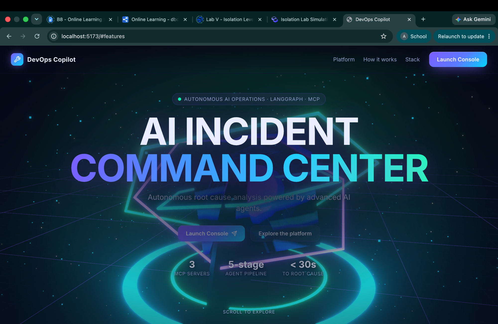
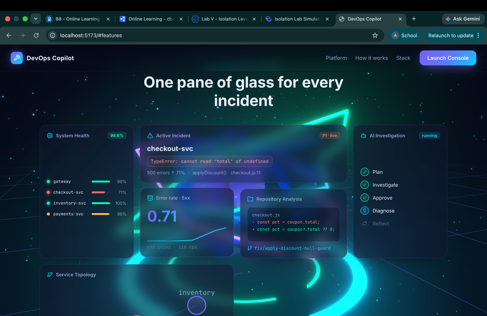
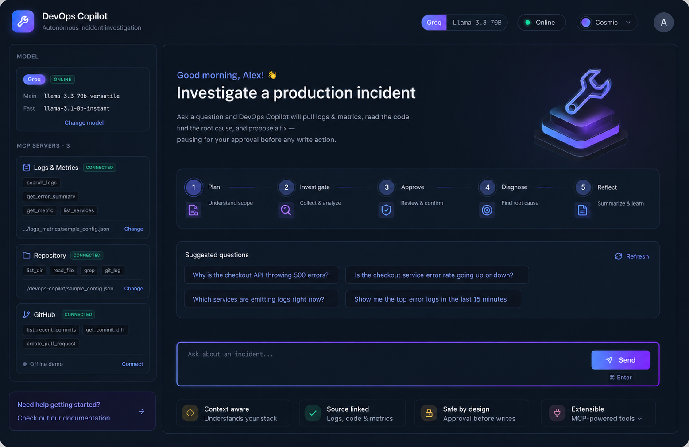

<div align="center">

# DevOps Copilot

**A production-hardened, autonomous incident-investigation agent** — a LangGraph state machine that pulls logs &amp; metrics, reads the code and git history, finds the root cause, and drafts a fix as a pull request, **pausing for human approval before it ever writes.**

[](https://github.com/ankit25bcs10610/DevOps-Copilot/actions/workflows/ci.yml)
[](LICENSE)


**LangGraph 6-node cyclic graph** · **8 custom MCP servers / 44 tools** · **structured RCA + postmortem** · **5 LLM providers** · **PagerDuty → Slack trigger loop** · **risk-tiered approval · prompt-injection guardrails · token budget** · **ruff · mypy · ESLint · pytest · Vitest in CI** · **one Docker image (SPA + API)**

</div>

<p align="center">
  
</p>

---

## Contents

- [Overview](#overview)
- [Highlights](#highlights)
- [Interface](#interface)
- [Architecture](#architecture)
- [How the agent works](#how-the-agent-works)
- [Human-in-the-loop, by design](#human-in-the-loop-by-design)
- [Production hardening](#production-hardening)
- [Quickstart](#quickstart)
- [Configuration](#configuration)
- [API surface](#api-surface)
- [Deployment](#deployment)
- [Scope &amp; scaling](#scope--scaling)
- [Evaluation](#evaluation)
- [Project structure](#project-structure)
- [Tech stack](#tech-stack)

---

## Overview

DevOps Copilot turns a one-line question — *"Why is the checkout API throwing 500s?"* — into an evidence-backed root-cause analysis. A **LangGraph** state machine drives an LLM across **eight custom MCP (Model Context Protocol)** tool servers: it plans, checks whether the incident has happened before, gathers logs · metrics · traces · Kubernetes state · Sentry errors, reads the code and git history, correlates the failure to a recent change, diagnoses the bug, and proposes a pull request — **stopping for your approval before any write action.** Every finished investigation is compiled into a **structured RCA report** (ranked hypotheses with verdicts and cited evidence, severity, confidence) plus a downloadable **blameless postmortem**. Progress streams live to a React console over Server-Sent Events.

It is a full-stack reference implementation of a modern agentic system, with the production concerns — auth, rate limiting, health probes, structured logging, graceful shutdown, a token-cost kill-switch, prompt-injection guardrails, a risk-tiered approval policy, an audit trail, tests, CI, and a single deployable Docker image — actually built, not hand-waved.

## Highlights

| | |
|---|---|
| **Structured RCA + postmortem** | Every finished investigation is compiled into a typed RCA object — **ranked hypotheses** each marked *validated / invalidated / inconclusive* with **cited evidence**, plus severity, affected services, and recommended actions — with a **calibrated confidence** that abstains ("insufficient evidence") on thin investigations instead of bluffing. Rendered as an expandable card and a one-click **blameless postmortem** download. |
| **Risk-tiered human approval** | A policy engine classifies every tool call **allow / notify / approve** by consequence, with a risk tier and a terraform-plan-style **impact preview** on the approval card. It's **argument-aware** (scaling a deployment to zero escalates to high-risk), and the gate is a resumable LangGraph `interrupt()` the routing can't bypass. See [Human-in-the-loop](#human-in-the-loop-by-design). |
| **Eight custom MCP servers** | `datadog` (logs/metrics + anomaly detection), `pagerduty` (alerting + ack/note/resolve), `kubernetes` (pods/events/rollouts + scale/rollback), `sentry` (issues/stack-traces), `traces` (span search + **blast-radius** reasoning), `github` (commits, CI logs, change-correlation, PRs), a path-sandboxed `repo` server, and an `incident-memory` server (BM25 search over prior RCAs/runbooks) — **44 tools** including deterministic **analysis** tools (critical-path/self-time attribution, SLO burn-rate, onset ordering, deploy-bisect, anomaly→trace exemplars, log-template clustering), each with **live-API + offline-fixture** modes, all hand-built on FastMCP/stdio and discovered at runtime via `langchain-mcp-adapters`. |
| **Trust & safety built in** | Untrusted tool output is **provenance-boxed and scanned for prompt injection** before it reaches the model; a per-investigation **token budget** hard-stops runaway cost; an append-only **audit trail** (queryable via `/audit`) records approvals, model changes, injection hits, and feedback. |
| **Triggered + delivered** | A signed **PagerDuty webhook** auto-starts an investigation; findings post to **Slack** with **Approve / Reject** buttons that resume the agent through the same approval gate — the agent shows up when you're paged. |
| **Learning loop** | Thumbs up/down on any answer is captured as a labeled case (`/feedback`); thumbs-down seeds a regression eval. The eval harness scores tool use **and** the structured verdict. |
| **5 LLM providers, switchable live** | Anthropic (Claude Opus 4.8), OpenAI, Gemini, Groq/Llama, DeepSeek — change provider, model, or key **from the UI with no restart**, validated server-side. Adaptive thinking runs only on the main Opus model. |
| **Production-hardened** | Bearer auth, per-IP rate limiting, request caps, `/healthz` + `/readyz`, graceful shutdown, structured JSON logs with request-ids, Sentry hook, and a fail-closed production config. See [Production hardening](#production-hardening). |
| **One Docker image** | A multi-stage build compiles the React + WebGL console and serves it from FastAPI — `docker compose up` gives you the whole product on `:8000`. |

## Interface

<table>
  <tr>
    <td></td>
    <td></td>
  </tr>
</table>

A React console with a live activity timeline, the human-in-the-loop approval card, a configurable sidebar (model · MCP servers · GitHub), and a WebGL command-center backdrop (React Three Fiber, lazy-loaded so it never blocks first paint).

## Architecture

```
        ┌─────────────┐   ┌──────────────────────┐
        │     CLI     │   │  React console + 3D  │      Interfaces
        └──────┬──────┘   └───────────┬──────────┘
               └──────────────┬───────┘   FastAPI: /chat[/stream], /approve[/stream],
                              ▼                     /config, /model, /sources, /github, …
        ┌────────────────────────────────────────────┐
        │            LangGraph state machine          │
        │                                             │
        │   plan ▶ agent ▶ (policy route)            │
        │            │  ├─ approve? ▶ approval ───────┤ ◀── human ✅ / ❌
        │            │  ├─ read?    ▶ tools ──────────┤  (guarded: injection-scanned)
        │            │  └─ done?    ▶ reflect ▶ report┤ ──▶ structured RCA + postmortem
        │            └─────────────◀──────────────────┘
        │   checkpointer: SQLite / Postgres (resumable, per-thread)
        │   per-run token budget · audit trail
        └────────────────────────┬───────────────────┘
                                 ▼   (MCP protocol, stdio)
   ┌──────────────────────┬──────────────────────┬───────────────────────────┐
   │ datadog (logs/metrics │ repo (sandboxed)    │  github (commits/CI/PRs)  │  MCP
   │  + detect_anomaly)    │  list_dir  read_file │  correlate_changes        │  servers
   │ pagerduty (alerts +   │  grep      git_log   │  list_workflow_runs       │  (7 total,
   │  ack/note/resolve W)  │                      │  get_failed_job_logs      │   34 tools)
   │ kubernetes (pods/roll-│ sentry (issues/      │  create_pull_request (W)  │
   │  outs + scale/rollbackW)│  stack-traces)     │  incident-memory (BM25)   │
   │ traces (spans +       │                      │                           │
   │  blast-radius)        │                      │                           │
   └──────────────────────┴──────────────────────┴───────────────────────────┘
                          8 MCP servers · 44 tools
```

> The agent never imports a server directly — it only sees the tools each MCP server advertises. Untrusted tool output is provenance-boxed and injection-scanned by a **guarded tool node** before re-entering the model's context. Full design notes in [`docs/ARCHITECTURE.md`](docs/ARCHITECTURE.md).

### Concurrency &amp; state

The FastAPI layer is built for more than one user at a time:

- A **writer-preferring reader/writer gate** lets agent turns run concurrently across threads while a config change (model / GitHub / sources / reset) drains in-flight turns and then runs exclusively — so a config swap can never tear a session down mid-investigation.
- **Per-thread locks** serialize a single thread's turns without blocking unrelated ones.
- A **bounded, LRU-evicted session pool** never drops a running or awaiting-approval thread; an evicted thread is transparently **reconstructed from the SQLite checkpointer** on its next request, so a pending approval survives.

## How the agent works

| Stage | What happens |
|-------|--------------|
| **1 · Plan** | Decompose the incident into a short investigation plan (cheap *fast* model, with prior-turn context on follow-ups). |
| **2 · Investigate** | Call read-only MCP tools — search prior incidents, read logs/metrics/traces, inspect Kubernetes + Sentry, grep code, correlate recent changes. Every result is injection-scanned before the agent sees it. |
| **3 · Approve** | If the agent wants a consequential action (open a PR, scale/rollback a deployment, resolve an incident), the graph **pauses** for human approval — with a risk tier and impact preview. |
| **4 · Diagnose** | Pinpoint the root cause and propose the fix, grounded in tool output. |
| **5 · Reflect** | Judge completeness (fast model). On *continue*, it hands the agent a **targeted gap note** so the next pass makes progress instead of repeating itself. |
| **6 · Report** | Compile a structured RCA — ranked hypotheses with verdicts + cited evidence, severity, recommended actions — with a **calibrated confidence** that abstains on thin evidence, and render a blameless postmortem. |

The loop is bounded twice over: at the iteration cap **or** the per-investigation token budget the agent is invoked **without tools** and forced to summarize, so a run can never end on an unexecuted tool call and runaway cost is hard-stopped. The graph's `recursion_limit` is derived from that cap, with a `GraphRecursionError` safety net.

## Human-in-the-loop, by design

The defining safety property: **the agent asks permission before it changes anything.**

- An **action policy engine** (`app/policy.py`) classifies every tool call **allow / notify / approve** by consequence and risk tier, **argument-aware** (e.g. `scale_deployment` to zero replicas escalates to high-risk/approve). Approve-class calls route through `approval_node`, which calls LangGraph's `interrupt()` and surfaces **every** tool call in the batch with its risk tier and an impact preview — so a reviewer never approves a hidden write bundled with reads.
- The routing (`app/graph/edges.py`) **cannot** reach the tool executor for an approve-class action without passing approval first.
- On rejection, each `tool_call_id` is still answered with a `ToolMessage`, keeping conversation history valid, and control returns to the agent to find another path.
- State is checkpointed, so the pause is **resumable across separate HTTP requests** (and even after the in-memory session is evicted). The gate is asserted in `tests/test_edges.py`.

## Production hardening

Every item below is in the code today (file references included so it's verifiable).

**Reliability** — `/healthz` (liveness) and `/readyz` (readiness; returns 503 in production until an LLM key is configured); a 30s-bounded graceful-shutdown drain that closes MCP subprocesses cleanly; the concurrency model above. `app/api/main.py`, `app/config.py`

**Security** — bearer-token auth with constant-time comparison (`hmac.compare_digest`); a per-IP rate limiter (memory-bounded, with a trusted-proxy guard for `X-Forwarded-For`); request-body and message-length caps returning `413`/`429` *inside* CORS so errors stay readable; a `/sources` path allowlist; **fail-closed startup** that refuses to boot `COPILOT_ENV=production` without an API token; a **risk-tiered action policy** (`app/policy.py`) gating consequential tools behind human approval; and **structural prompt-injection defenses** (`app/guardrails.py`) — every tool output is provenance-boxed and pattern-scanned before the model sees it, with detections audited. `app/api/main.py`, `app/policy.py`, `app/guardrails.py`

**Cost control** — per-LLM-call token-usage logging (input / output / cache-read) aggregated into a **per-investigation token budget** that hard-stops the agent loop (`COPILOT_MAX_TOKENS_PER_RUN`), surfaced per-turn in the UI. `app/graph/nodes.py`, `app/graph/state.py`

**Observability** — structured JSON logs in production (text in dev), each record carrying a request-id propagated end-to-end via a contextvar; an append-only, **queryable audit trail** (`GET /audit`) of approvals, model changes, injection detections, and feedback (`app/audit.py`); a **feedback loop** (`/feedback`) capturing labeled cases; optional LangSmith tracing and **Sentry** error tracking (`SENTRY_DSN`). `app/observability.py`, `app/audit.py`, `app/feedback.py`

**Testing &amp; CI** — a **pytest suite (100+ tests)** covering the approval policy + routing, the RCA report parsing/rendering, the token-budget kill-switch, the prompt-injection guardrails, the fail-closed config validator, the repo path-traversal/symlink sandbox, per-provider key isolation, the auth / rate-limit / body-cap middleware, the webhook signature gates, and every connector's offline path — all without an LLM key. CI (`.github/workflows/ci.yml`) runs **ruff + mypy + pytest** on the backend and **ESLint + tsc typecheck + Vitest + Vite build** on the frontend, every push and PR.

**Accessibility** — `prefers-reduced-motion` support (pauses the 3D render loop, static fallback), ARIA roles/labels and a screen-reader live region for the streaming trace, a skip-to-content link, WCAG-AA-checked contrast, and a cancellable Stop control with conversation persistence across reloads. `frontend/src/`

## Quickstart

> Runs **fully offline** out of the box (no GitHub needed) — only an LLM API key is required. All five providers ship in the base install.

### 1 · Backend

```bash
uv venv && uv pip install -e .

cp .env.example .env
#   anthropic (default):  ANTHROPIC_API_KEY=sk-ant-...     (Claude Opus 4.8)
#   or e.g.:  COPILOT_PROVIDER=groq   GROQ_API_KEY=gsk_...
#   (openai · gemini · deepseek also supported — set COPILOT_PROVIDER + its key)
```

Try it from the CLI:

```bash
uv run copilot "Why is the checkout API throwing 500 errors?"
```

…and watch it plan, call MCP tools across services, find the bug in `sample_repo/checkout.js`, and ask permission before opening a PR.

Or run the API (it also serves the built console once you've run the frontend build):

```bash
uv run uvicorn app.api.main:app --reload      # http://localhost:8000
```

### 2 · Frontend (dev server with hot reload)

```bash
cd frontend
npm install
cp .env.example .env          # VITE_API_URL=http://localhost:8000
npm run dev                   # http://localhost:5173
```

For a single-artifact run (SPA served by the backend), see [Deployment](#deployment).

## Configuration

Set in `.env` (most are also changeable live from the console UI — those overrides are **in-memory only**, not persisted across restarts):

| Variable | Default | Description |
|----------|---------|-------------|
| `COPILOT_PROVIDER` | `anthropic` | `anthropic` · `openai` · `gemini` · `groq` · `deepseek` |
| `ANTHROPIC_API_KEY` / `OPENAI_API_KEY` / `GEMINI_API_KEY` / `GROQ_API_KEY` / `DEEPSEEK_API_KEY` | — | Key for the active provider |
| `COPILOT_MODEL` / `COPILOT_FAST_MODEL` | per-provider defaults | Override the main / fast model (defaults live in `app/llm.py`) |
| `TARGET_REPO_PATH` | `./sample_repo` | Repo the `repo` MCP server reads (confined by `COPILOT_SOURCES_ROOT`) |
| `LOGS_DATA_PATH` | `./app/mcp/servers/logs_metrics/sample_data` | Logs/metrics data dir |
| `GITHUB_TOKEN` / `GITHUB_REPO` | — | Real GitHub mode (else offline demo) |
| `COPILOT_ENV` | `development` | `production` fails closed unless `COPILOT_API_TOKEN` is set |
| `COPILOT_API_TOKEN` | — | Bearer token guarding the API (empty = open, dev only) |
| `COPILOT_MAX_ITERATIONS` | `8` | Max agent steps per turn |

> Production knobs (rate limit, body/message caps, `COPILOT_MAX_SESSIONS`, trusted-proxy, CORS) are documented in [`.env.example`](.env.example) and [`DEPLOY.md`](DEPLOY.md).

## API surface

| Endpoint | Purpose |
|----------|---------|
| `POST /chat` · `POST /chat/stream` | Start an investigation (JSON, or live SSE) |
| `POST /approve` · `POST /approve/stream` | Resume a paused approval with a decision |
| `GET /config` · `POST /model/configure` | Inspect / switch provider, model, key |
| `POST /github/connect` · `/github/disconnect` · `GET /github/status` | Live GitHub mode (validated server-side) |
| `POST /sources/repo` · `/sources/logs` · `POST /reset` | Point tools at your data / revert overrides |
| `GET /metrics` | Real metric series + error summary |
| `POST /feedback` | Thumbs up/down on an investigation (feeds the eval loop) |
| `GET /audit` | Queryable audit trail (approvals, model changes, injection hits, feedback) |
| `POST /webhooks/pagerduty` | PagerDuty trigger → auto-investigate (HMAC-verified) |
| `POST /webhooks/slack/interactions` | Slack Approve/Reject callback (signature-verified) |
| `GET /healthz` · `GET /readyz` | Liveness / readiness probes (auth-exempt) |

## Deployment

The image builds the SPA and serves it from FastAPI, so `http://localhost:8000` is the full product:

```bash
docker compose up --build
```

It runs as a non-root user, persists the SQLite checkpoint DB to a volume, and ships a `HEALTHCHECK`. Production setup — auth token, `COPILOT_ENV=production`, limits, same-origin auth — is in **[`DEPLOY.md`](DEPLOY.md)**.

## Scope &amp; scaling

The app is production-*hardened* and ships the **multi-tenant foundations**: a **Postgres checkpointer** (built-in — set `COPILOT_CHECKPOINT_DB` to a `postgres://` URL + the `postgres` extra), an encrypted **secret-vault** primitive (`app/secrets_vault.py`), and the audit trail. It still runs **single-instance by default** (SQLite + in-process MCP subprocesses), which is the right shape for the single-artifact demo. The remaining steps to full multi-tenant SaaS — per-tenant orgs/RBAC/SSO and request-scoped config (replacing the in-process runtime globals), a shared rate limiter, and remote HTTP MCP — are deliberately **not** done, and are mapped onto the code in [`docs/PRODUCT-ARCHITECTURE.md`](docs/PRODUCT-ARCHITECTURE.md) and [`DEPLOY.md` §6](DEPLOY.md). Framed as next steps, not claimed as done.

## Evaluation

```bash
uv run python -m evals.run_evals
```

Runs cases from `evals/testcases.yaml` against a live agent session and scores **keyword recall**, **tool-usage correctness**, the **structured RCA verdict** (root cause named + valid severity), and **latency** (write actions auto-approved). Thumbs-down feedback captured in production (`/feedback`) is the natural source of new regression cases.

## Project structure

```
app/
  api/        FastAPI surface — chat/approve (+SSE), config, model, sources, github, feedback, audit, webhooks, probes
  graph/      LangGraph: state, nodes (plan/agent/approval/tools/reflect/report), edges, builder, prompts
  mcp/        client wiring + eight custom MCP servers (FastMCP/stdio): datadog, pagerduty,
              kubernetes, sentry, traces (blast-radius), github, repo, memory (incident search)
  policy.py   risk-tiered action policy (allow / notify / approve + impact preview)
  guardrails.py     prompt-injection detection + provenance-boxing of tool output
  audit.py / feedback.py   queryable audit trail + thumbs up/down capture
  secrets_vault.py  Fernet secret-vault primitive (multi-tenant foundation)
  llm.py      provider factory (Anthropic / OpenAI / Gemini / Groq / DeepSeek)
  runtime.py  in-memory runtime overrides (model, sources, GitHub) — not persisted
  session.py  ties MCP + graph together; drives the approval flow; persistent MCP sessions
  observability.py  structured logging + request-id + LangSmith + Sentry
  config.py   typed settings with fail-closed production validation
frontend/
  src/components/   Hero3D (R3F, lazy-loaded), Console, Sidebar, RcaReportCard, ApprovalCard, …
  src/hooks/        useCopilot (streaming + cancel + persistence + feedback), useConfig, useTheme
tests/        100+ pytest suite (API, config, edges, policy, guardrails, report, connectors, …)
evals/        eval harness (scores verdict + tools) + test cases
sample_repo/  fixture repo with a planted bug
```

## Tech stack

**Agent:** LangGraph · `mcp` (FastMCP) · `langchain-mcp-adapters` · LangChain
**Models:** Claude Opus 4.8 (`langchain-anthropic`, adaptive thinking) · OpenAI · Gemini · Groq/Llama · DeepSeek
**API:** FastAPI · SQLite / Postgres checkpointer · bearer auth · rate limiting · SSE · health/readiness probes
**Frontend:** React 18 · TypeScript · Vite · React Three Fiber + drei + postprocessing (lazy-loaded)
**Tooling:** uv · ruff · mypy · pytest · ESLint · Vitest · GitHub Actions · multi-stage Docker

---

<div align="center">

[MIT](LICENSE) — built as a portfolio / learning project.

</div>
